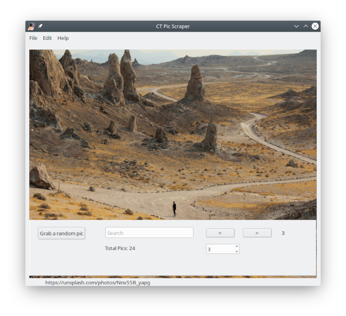

# CT-Pic-Grabber
Grab and save random pictures from [unsplash.com](https://unsplash.com)

## About this App:

This application was created in free pascal using [Code Typhon Studio](https://www.pilotlogic.com) which is a fork of [Lazarus IDE](https://www.lazarus-ide.org/).

The source code is a companion to my [Youtube tutorial](https://youtu.be/EE6NcXnxMfY) on how to scrape a website.  Although I reccommend using a website's [API](https://unsplash.com/developers) for getting content, this is a **website friendly low volume app** intended to teach the basics of web scraping when an API is not available.

## Features:

By default you can randomly grab a picture from the unsplash.com homepage.

Use the **Search** field to find specific pictures.

Use the **Arrow buttons, or keys on your keyboard** to scroll through the available pictures.

**Direct enter a number** in the *number field* to load a specific image from your list.

Use the **Z** key to remove the panels for a clean picture view.  Press **Z** again to restore the controls.

**Save** your pictures using the main menu *File, Save* or **CTRL+S** on the keyboard.

** Save full set ** - Save all the grabbed images.
